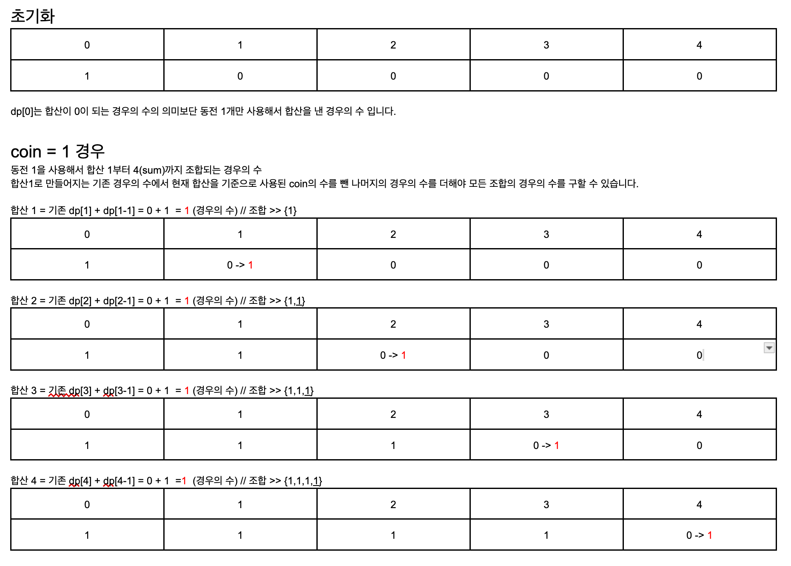
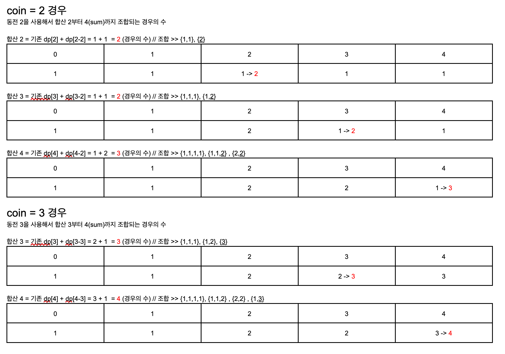

# 접근 방식 (DP 풀이)
- 각 동전을 무한히 사용할 수 있으며, 특정 합계를 만드는 모든 방법의 수를 동적 계획법(Dynamic Programming, DP) 을 사용하여 해결할 수 있습니다.
- 모든 조합을 출력할 수 있는 백트래킹(DFS) 방식은 완전 탐색으로 모든 조합을 탐색하므로 불필요한 중복 계산 발생으로 동전의 수(N)이 커질 수록 실행 시간이 증가하여 최악의 경우 O(2^N)의 시간이 걸립니다.
- 이전 경우의 수 값을 저장하고 재사용(Memoization)하는 방식을 사용해서 중복 계산을 방지하여 DFS보다 실행 속도가 빠르며, DP 배열만 사용하면 추가적인 Stack 호출 없이 메모리도 절약 가능하여 효율적인 방식입니다. 

# 시간복잡도
- O(N * sum) N은 동전의 개수, sum은 주어진 합산
- 1차원 DP 배열을 사용하는 공간복잡도 O(sum)

# Java 코드 구현
```java
public class Task02 {

    /**
     * 동전으로 특정 합계를 만드는 모든 방법의 수 (동전 중복 사용 가능)
     * @param sum : 정수 합산
     * @param coins : 정수 배열
     * @return 주어진 동전 조합으로 sum을 만드는 모든 방법의 수
     */
    private int getCoinWays(int sum, int[] coins) {

        // dp 정의
        int[] dp = new int[sum + 1]; // 합계 0부터 sum 까지 다양한 동전 조합의 모든 경우의 수
        dp[0] = 1; // 동전 단일로 사용한 경우 1로 초기화

        // dp 점화식
        for (int coin : coins) { // 여러 동전 조합으로 만들 수 있는 합산의 모든 경우의 수
            for (int i = coin; i <= sum; i++) {
                dp[i] += dp[i - coin];
            }
        }

        return dp[sum];
    }

    public static void main(String[] args) {
        Task02 T = new Task02();

        System.out.print("입력 1번 결과 : ");
        System.out.println(T.getCoinWays(4, new int[]{1, 2, 3}));
        System.out.print("입력 2번 결과 : ");
        System.out.println(T.getCoinWays(10, new int[]{2, 5, 3, 6}));
    }
}


```
- 여러 동전 조합으로 만들 수 있는 합산의 모든 경우의 수를 구하기 위해 각 coin 동전을 여러 번 사용해서 만들 수 있는 합산 i의 경우의 수를 점진적으로 누적하며 다양한 동전들의 조합의 합산에 대한 모든 경우의 수를 구합니다. 
- dp 점화식 dp[i] = dp[i] + dp[i - coin]은 합산 i가 되는 기존 경우의 수와 합산 i에서 현재 coin을 사용하고 남은 나머지 합산 경우의 수를 더하여 동전 조합의 모든 경우의 수를 구할 수 있습니다.

# 접근 방식 풀이
## 예제 1번을 통한 설명
- 입력: sum = 4, coins[] = {1,2,3},
- 출력: 4
- 설명: {1, 1, 1, 1}, {1, 1, 2}, {2, 2}, {1, 3}
 



